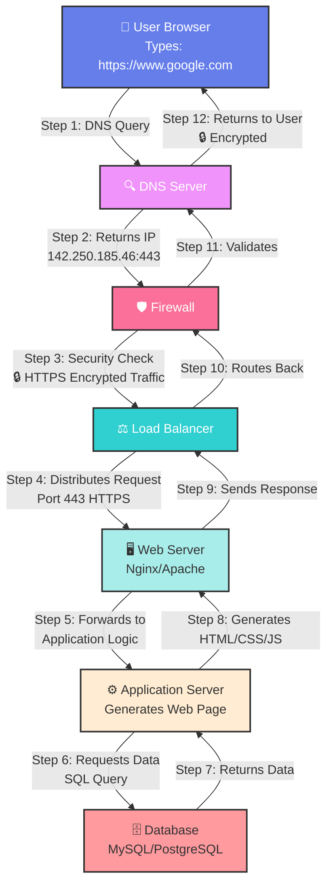

```mermaid
graph TD
    A[👤 User Browser<br/>Types: https://www.google.com] -->|Step 1: DNS Query| B[🔍 DNS Server]
    B -->|Step 2: Returns IP<br/>142.250.185.46:443| C[🛡️ Firewall]
    
    C -->|Step 3: Security Check<br/>🔒 HTTPS Encrypted Traffic| D[⚖️ Load Balancer]
    
    D -->|Step 4: Distributes Request<br/>Port 443 HTTPS| E[🖥️ Web Server<br/>Nginx/Apache]
    
    E -->|Step 5: Forwards to<br/>Application Logic| F[⚙️ Application Server<br/>Generates Web Page]
    
    F -->|Step 6: Requests Data<br/>SQL Query| G[🗄️ Database<br/>MySQL/PostgreSQL]
    
    G -->|Step 7: Returns Data| F
    F -->|Step 8: Generates HTML/CSS/JS| E
    E -->|Step 9: Sends Response| D
    D -->|Step 10: Routes Back| C
    C -->|Step 11: Validates| B
    B -->|Step 12: Returns to User<br/>🔒 Encrypted| A
    
    style A fill:#667eea,stroke:#333,stroke-width:2px,color:#fff
    style B fill:#f093fb,stroke:#333,stroke-width:2px,color:#fff
    style C fill:#fa709a,stroke:#333,stroke-width:2px,color:#fff
    style D fill:#30cfd0,stroke:#333,stroke-width:2px,color:#fff
    style E fill:#a8edea,stroke:#333,stroke-width:2px,color:#333
    style F fill:#ffecd2,stroke:#333,stroke-width:2px,color:#333
    style G fill:#ff9a9e,stroke:#333,stroke-width:2px,color:#333
```